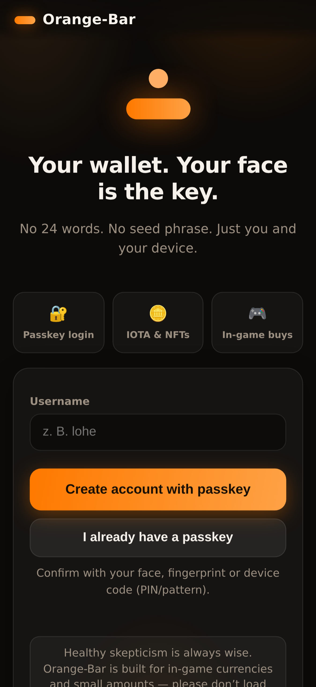
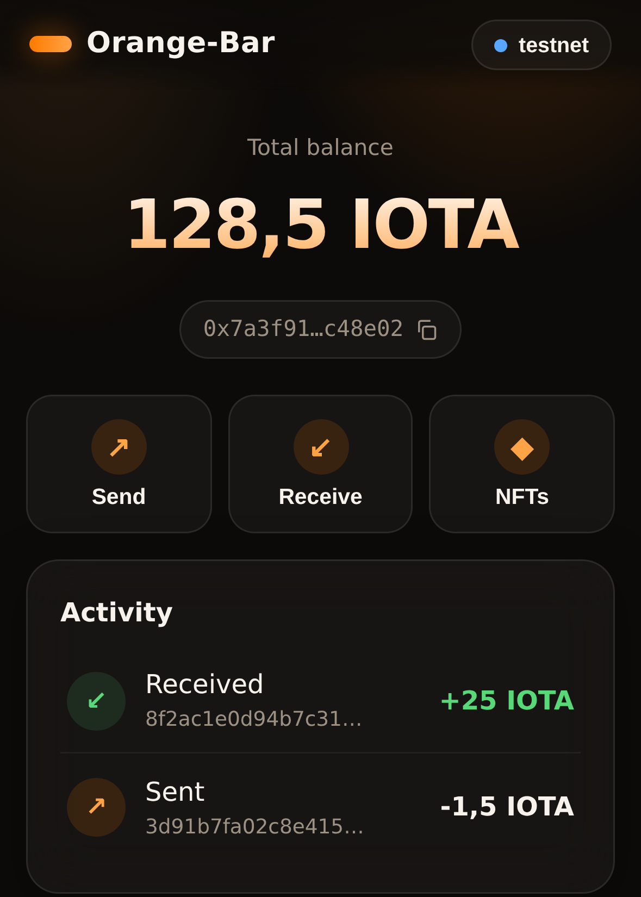
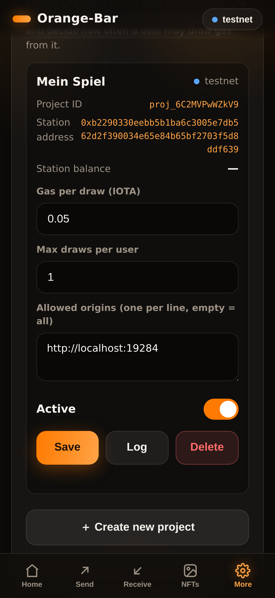
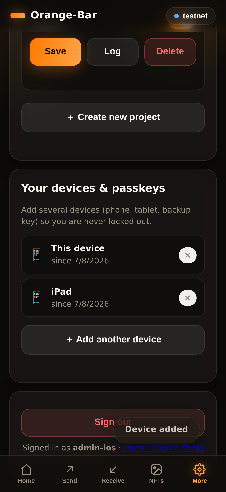
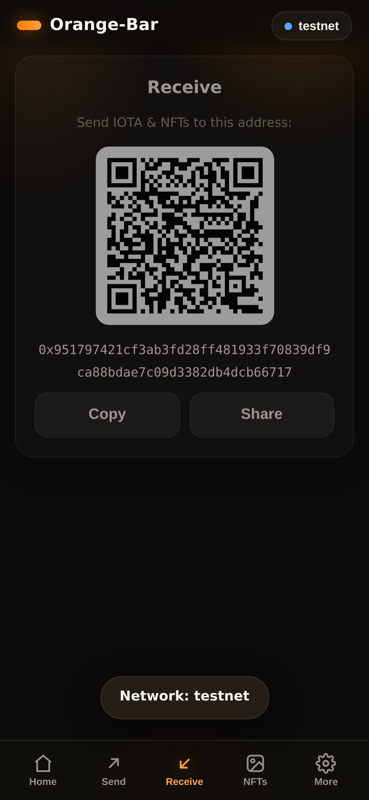
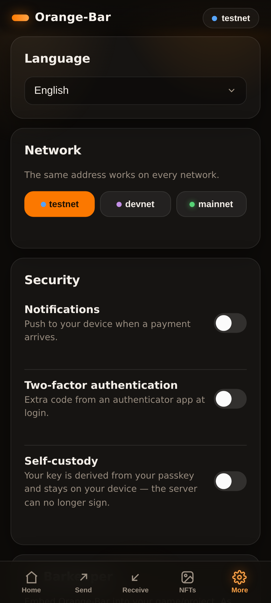

# 🟠 Orange-Bar

**Your wallet. Your face is the key.**

*(Deutsche Version: [README.de.md](README.de.md) · The UI starts in English and ships in 16 languages.)*

---

---

---

---

## v1.2.1 (July 2026)

- **Fixed a "digest front-running" gap in the facilitator:** tx digests become public as soon as a payment is confirmed on-chain, so the original verify/settle design (checked only address + amount) let a third party who merely observed someone else's confirmed payment race to redeem it for a paywalled resource before the actual payer did. The merchant still got paid, but the wrong party could get the resource.
- **Fix:** one-time payment challenges (`facilitator_challenges`) — every `402` now issues a unique `challengeId` plus a micro-jittered exact amount (< 0.001 IOTA over the base price); settlement requires an exact match against that specific, single-use challenge. `server/paywall.js` and the MCP `pay_for_resource` tool use this automatically; the raw `/api/facilitator/settle` API still accepts the old address+amount-only call for merchants who implement their own binding, now clearly documented as the less-safe path. See [docs/FACILITATOR.md](docs/FACILITATOR.md) § 5.

## v1.2.0 (July 2026) — Facilitator (a payee for agents)

**In short:** Agent stations (v1.1.0) make agents able to pay — but without anyone accepting IOTA, there's nothing to pay for. v1.2.0 closes that gap with a minimal, **non-custodial** x402-style facilitator: the agent pays a merchant address **directly** via `station_pay`, and Orange-Bar only verifies the resulting payment proof (tx digest) to unlock the resource. Architecture, flow & MiCA framing: **[docs/FACILITATOR.md](docs/FACILITATOR.md)**.

- `POST /api/facilitator/verify` · `POST /api/facilitator/settle` — pre-check vs. one-time consumption of a payment proof (replay protection)
- `server/paywall.js` — middleware for your own routes: no `X-Payment-Digest` → `402` with payment requirements, valid proof → pass through
- New MCP tool `pay_for_resource(url)` — calls a URL, on `402` pays automatically from the agent station, retries with the proof: the agent pays for a real resource on its own
- Optional demo route `GET /api/facilitator/demo/resource` (active once `ORANGE_FACILITATOR_DEMO_PAYTO` is set)

## v1.1.1 (July 2026)

- **Fixed a race condition in agent station payments:** two concurrent `station_pay` calls could each read the daily limit before either recorded its spend, allowing the limit to be exceeded. Limit-checking and usage-booking now happen inside one synchronous DB transaction *before* the on-chain send; a failed send rolls the reservation back.
- **Added `idempotencyKey` to `POST /api/agent/station/pay`** (and the MCP `station_pay` tool): an agent retry after a timeout/error with the same key returns the original result instead of paying twice from the float.

## v1.1.0 (July 2026) — AI agents

**In short:** Orange-Bar can now talk to AI agents (Cursor, bots, scripts) **without** weakening passkey protection on the user wallet. Agents can read balances, *propose* payments, or spend from an optional **agent station** float. Architecture & MiCA notes: **[docs/AGENT_ARCHITECTURE.md](docs/AGENT_ARCHITECTURE.md)**.

### What’s new?

| Capability | What the agent may do | Who confirms? |
|---|---|---|
| **Read** (`read`) | Address, network, balance | — |
| **Propose** (`pay_request`) | Create a pay request (same as in-game SDK) | **You** with a passkey in the PWA |
| **Station float** (`station_spend`) | Pay from a separate hot wallet | Server (station key) within your limits |

The user wallet (PRF/passkey) is **never** signed by the agent. The agent station is a **deliberate extra float** (address ≠ your wallet), similar to Barkeeper gas — only fund small amounts.

### Settings in the app

Path: **Settings → Agents**

#### 1. Create an agent token

1. Open “＋ Create agent token”  
2. Set options (see table)  
3. **Create with passkey** (Face ID / fingerprint / PIN)  
4. Save the `oba_…` token **once** via Copy or QR — it won’t be shown again  
5. **Revoke** anytime (✕ in the list)

| Setting | Meaning |
|---|---|
| **Label** | Name in the list and push hints (e.g. “Cursor”) |
| **Scopes** | `Read balance` · `Create pay requests` · `Spend from station` |
| **Max per request** | Cap per proposal/station payment (IOTA, empty = none) |
| **Daily limit** | Sum per UTC day (IOTA, empty = none) |
| **Valid for (days)** | Token lifetime (1–365, default 30) |
| **Network lock** | Only `testnet` / `devnet` / `mainnet` — or any |
| **Project ID** | Optional: only this Barkeeper project |
| **Bind to station** | Optional: `station_spend` only for that station |
| **Allowed addresses** | Allowlist (one `0x…` per line, empty = any) |

#### 2. Agent station (optional, for autonomous spends)

1. “＋ Create station” → passkey  
2. Copy the station **address** and fund it with a normal wallet transfer  
3. Set station limits (max / day / allowlist / network)  
4. Create a token with scope **Spend from station** (ideally bound to that station)

Without a station, agents stay in safe **propose-only** mode: they create pay requests, you confirm in the PWA.

### How it works with Cursor / MCP

1. Create and copy a token in Settings  
2. Configure MCP (example):

```json
{
  "mcpServers": {
    "orange-bar": {
      "command": "node",
      "args": ["mcp/orange-bar-mcp.js"],
      "env": {
        "ORANGE_BAR_URL": "https://your-orange-bar.example",
        "ORANGE_BAR_AGENT_TOKEN": "oba_…"
      }
    }
  }
}
```

3. Or run `npm run mcp` with the same environment variables  

**MCP tools:** `get_balance` · `create_payment` · `get_payment_status` · `list_stations` · `station_pay`

### REST at a glance

| Who | Endpoint | Purpose |
|---|---|---|
| You (session) | `POST /api/agent/tokens/prepare` + `/confirm` | Token with passkey |
| You (session) | `POST /api/agent/stations/prepare` + `/confirm` | Station with passkey |
| Agent (Bearer) | `GET /api/agent/wallet/summary` | Read balance |
| Agent (Bearer) | `POST /api/agent/pay/request` | Propose payment |
| Agent (Bearer) | `POST /api/agent/station/pay` | Pay from float |

### Security (core unchanged)

- Every spend from the **user wallet** still needs a fresh **WebAuthn** confirmation  
- Tokens stored as SHA-256 hashes only; plaintext shown once  
- Revoke takes effect immediately  
- Station and user address stay separate — no commingling with the passkey wallet  

## v1.0.5 (July 2026)

- **Mintly login in non-custodial mode:** HMAC attestation (`ORANGE_MINTLY_LOGIN_SECRET`) instead of server signing — restored (was a live-server local patch)

## v1.0.4 (July 2026)

- **Pack/game unlock:** pay request is `confirmed` as soon as a tx **digest** exists (not only when effects status is perfect)
- Redirect also passes `ob_digest`; SDK `checkReturn()` uses digest + longer polling — fixes “bought pack but opening returns to character select”

## v1.0.3 (July 2026)

- **In-game payment fix:** pay request status is reliably set to `confirmed` after a successful tx (status from `waitForTransaction`, not the first RPC response)
- **SDK `checkReturn()`:** brief polling when redirect says `ob_status=confirmed` but the API still returns `pending` — fixes “payment not confirmed” while IOTA was deducted

## v1.0.2 (July 2026)

**In short:** non-custodial mode requires **passkey PRF** (key derivation from the passkey). Many **older phones** support passkeys (PIN/fingerprint) but **not PRF** — registration no longer fails only after the passkey prompt; the app **explains upfront**.

### PRF device check on the login screen

On open (non-custodial mode), Orange-Bar uses `PublicKeyCredential.getClientCapabilities()` to see whether the browser reports **`extension:prf`**:

| UI | Meaning |
|---|---|
| **Green check ✓** | PRF available — non-custodial registration OK |
| **Red ✗** | No PRF (common on older devices/browsers) — registration blocked, with guidance |
| **Amber ?** | Browser does not report PRF — you may try to register; same fallbacks on failure |

### Pragmatic approach (no largeBlob)

We **deliberately do not** use WebAuthn `largeBlob` for wallet seeds (wrong tool, fragmented support). Instead:

1. **PRF** — standard path for non-custodial (as in v1.0.0)
2. **Newer device / updated browser** (e.g. Chrome, Safari with PRF)
3. **Custodial mode** by the operator (`ORANGE_CUSTODIAL_MODE=1`) for devices without PRF — see **[docs/CUSTODIAL.md](docs/CUSTODIAL.md)**

Operators and users can see on login whether the device is suitable for non-custodial use.

## v1.0.1 (July 2026)

- **Legal pages** via `ORANGE_LEGAL_*` (imprint, privacy, terms) — **[docs/LEGAL.md](docs/LEGAL.md)**
- **Disclaimer:** included legal texts are non-binding templates; no liability by project authors

## What's new in v1.0.0? (July 2026)

**In short:** as of **v1.0.0**, Orange-Bar is **non-custodial by default**. The server no longer signs user transactions — keys are derived on-device via **passkey PRF**. This is a deliberate **architecture and compliance decision**, not just a feature tweak.

### Why this change?

Until v0.1.x, Orange-Bar was **custodial by default**: the server generated and held encrypted user keys. For EU business operation, that typically triggers **MiCA CASP obligations** (custody, ~€125k capital, AML/KYC, BaFin licence). For a self-hosted in-game wallet without those resources, that's not a viable default.

**v1.0.0 flips the model:**

| Before (v0.1.x) | Now (v1.0.0) |
|---|---|
| Custodial = default | **Non-custodial = default** |
| Self-custody optional (toggle) | PRF wallet at registration |
| Server signs after passkey | **Device signs**, server only broadcasts |
| High MiCA risk for operators | **Much lower** for user wallets |

### Two modes — one repository

No separate branch required — both modes live in the same codebase:

| Mode | Enable with | When to use |
|---|---|---|
| **Non-custodial** | *(leave unset)* | Production, EU business, mainnet |
| **Custodial** (legacy) | `ORANGE_CUSTODIAL_MODE=1` | Demos, devices without PRF, with compliance |

Custodial mode shows **warning banners** in the app and **startup warnings** in server logs. See **[docs/CUSTODIAL.md](docs/CUSTODIAL.md)**.

### Legal pages (operator responsibility)

Anyone who **publicly hosts** Orange-Bar must identify themselves as the **service provider** — regardless of wallet mode. Set `ORANGE_LEGAL_*` environment variables; the app links to imprint, privacy policy, and terms.

**Key variable:** `ORANGE_LEGAL_NAME` = your official company or personal name (not just “Orange-Bar”).

Full field reference: **[docs/LEGAL.md](docs/LEGAL.md)** (German, with examples).

> **Disclaimer:** The included legal texts (imprint, privacy policy, terms) are non-binding templates. The project authors **accept no liability** for their completeness, accuracy, or legal adequacy. Each operator is solely responsible for compliant wording.

### Migrating existing deployments

1. **Fresh instance / new DB:** deploy v1.0.0 — new users get PRF wallets automatically.
2. **Existing custodial users:** old accounts still have server keys → they can migrate directly in non-custodial mode: the app shows the self-custody toggle (More → Security) for these legacy accounts; sending is blocked until migration. Alternatively run with `ORANGE_CUSTODIAL_MODE=1`.
3. **Barkeeper gas stations:** unchanged — those are **your** operational wallets, not user custody.

### Technical highlights v1.0.0

- `POST /api/wallet/setup` — PRF-first wallet after registration
- `GET /api/config` — mode for the frontend (`walletMode`, `custodialMode`)
- Client signing for IOTA **and NFTs**; SDK payments with `payRequestId` fixed
- Identity phase 1–2 (age gates) retained; `did:key` from wallet public key

---

> ⚠️ **Healthy skepticism is always wise.** Orange-Bar is deliberately built for **in-game
> currencies and small amounts** — for a lightweight game/app experience, not as a vault.
> **Don't load large savings into it.** As with any wallet: only deposit what you could
> afford to lose.

Orange-Bar is a mobile wallet app (PWA) for **IOTA and NFTs** where everything runs
through **passkeys**: create an account, sign in, and **confirm every transaction with
Face ID, a fingerprint or your device code** — no 24-word seed phrase at all.

<p align="center">
  
  
  
  
</p>

## Features

- 📱 **Runs everywhere** — in the mobile browser and as an installable app on Android
  ("Add to home screen") and iPhone (Share → "Add to Home Screen").
- 🔐 **Passkey instead of a seed phrase** — registration and login via WebAuthn
  (`userVerification: required`).
- 👆 **Works on older phones too** — WebAuthn's user verification is satisfied by
  whatever unlocks the device: Face ID, fingerprint, **or the screen-lock code
  (PIN/pattern)**. Phones without biometrics simply confirm with their device code.
- 🙂 **Each transaction confirmed individually** — a passkey challenge is bound to the
  exact transaction data.
- 🪙 **IOTA & NFTs** — show balance, receive, send to any address (IOTA Rebased via
  `@iota/iota-sdk`).
- 🌐 **Network switcher** — Testnet / Devnet / Mainnet in-app (Mainnet with a warning).
  The same address works on every network.
- 🔒 **Optional 2FA (TOTP)** — per account, compatible with Google Authenticator, Aegis,
  1Password; QR-code setup.
- 🔑 **Multiple passkeys / devices per account** — add a phone, tablet or backup key so
  you are never locked out; the last passkey can't be removed.
- 🔔 **Push on incoming payments** — Web-Push notifications when funds arrive.
- 🍹 **Barkeeper model** — anyone who embeds Orange-Bar runs their own gas station and
  decides how much gas each user may draw (see below).
- 🎮 **In-game SDK** — games embed `sdk/orange-bar-sdk.js` and request payments; the user
  confirms in Orange-Bar with a passkey. Popup **and** mobile-friendly redirect mode.
- 🛡️ **Optional self-custody (beta)** — non-custodial mode via the WebAuthn **PRF**
  extension: the key is derived from your passkey, the server deletes its copy, and the
  browser signs transactions **locally**. The client signature is proven byte-identical to
  `@iota/iota-sdk` (see `tests/iota-sign.test.js`). Only for advanced users / small amounts:
  lose your passkey and seed backup and the funds are unrecoverable.
- 🌍 **16 languages** — automatic detection, in-app switcher, right-to-left for Arabic.
- 🎨 **Modern mobile UI** — glassmorphism, bottom-tab navigation, QR codes, activity feed,
  haptic feedback.

<p align="center">
  
  
</p>

## The Barkeeper model (embed it anywhere)

Orange-Bar is meant to be **embedded by anyone**. Whoever integrates it into their
game/project becomes the **Barkeeper** — the admin of their own space:

- Any signed-in user can create a **Project** and thereby become its Barkeeper.
- Each project has its **own gas station** (a dedicated wallet the Barkeeper tops up).
- The Barkeeper sets **how much gas a user gets per draw** and the **maximum number of
  draws per user** — so end users can start on any smartphone without owning gas first,
  while the Barkeeper stays in control of the budget.
- Each project has an **allowed-origins list**: only the Barkeeper's own sites may create
  payment requests or trigger gas draws, which protects the gas station from abuse.

Embed with a project id:

```html
<script src="https://your-orange-bar/sdk/orange-bar-sdk.js"></script>
<script>
  const ob = new OrangeBar('https://your-orange-bar', { projectId: 'proj_…' });
  const result = await ob.requestPayment({
    to: '0x…', amountIota: '1.5', memo: 'Sword of Fire', mode: 'auto',
  });
  if (result.status === 'confirmed') { /* unlock the item */ }
</script>
```

When a payment request belongs to a project, Orange-Bar offers the player a **"Get gas"**
action (and auto-tops-up once if their balance is empty), funded by the Barkeeper's gas
station and capped by the per-user limit.

> Each station is its own custodial Ed25519 wallet; its key is encrypted with AES-256-GCM
> just like user wallets. Project secrets are stored only as SHA-256 hashes. The per-user
> limit is enforced race-safely (a pending grant is reserved inside a DB transaction
> before the on-chain payout).

## Self-custody (optional, non-custodial via WebAuthn PRF)

By default Orange-Bar is **custodial** (the server holds the encrypted key — best UX).
For full self-custody, enable it under *More → Security → Self-custody*:

1. The seed is exported **once**, guarded by a passkey confirmation (only while still
   custodial).
2. A secret is derived from the passkey via the **WebAuthn PRF extension**, which
   encrypts the seed client-side with AES-256-GCM.
3. The server **deletes its copy** of the key and keeps only the PRF-encrypted seed.
   From then on, **the browser signs locally**: the server builds the transaction bytes,
   the device decrypts the seed via the passkey and produces the Ed25519 signature; only
   the finished signature is sent back.

The client-side signature is proven **byte-identical** to `@iota/iota-sdk`'s (intent
`TransactionData` → BLAKE2b-256 → Ed25519 → a 1+64+32-byte signature) —
`tests/iota-sign.test.js` verifies this against the SDK, no network required.

> **Honest disclaimer:** non-custodial means full self-responsibility. Lose your passkey
> **and** your seed backup and the funds are gone for good — there is no server-side
> recovery. That's why this mode is **beta**, opt-in, and recommended only for small
> in-game amounts. It requires a browser/authenticator with PRF support; without PRF the
> app simply stays in the (more convenient) custodial mode.

### Where is the passkey connected to the seed — and where is that stored?

The binding happens **exclusively on the device** (in the browser), never on the
server. The complete logic lives in [`public/prf.js`](public/prf.js) and
[`public/app.js`](public/app.js):

1. **Fetch the PRF output** — `getPrfOutput()` (`public/prf.js`) runs a WebAuthn
   assertion with the **PRF extension** (fixed eval salt
   `orange-bar/self-custody/v1`). The authenticator returns a **32-byte secret
   that is unique and stable per passkey**. This secret never leaves the device.
2. **Seed derivation (new accounts)** — `setupNonCustodialWallet()`
   (`public/app.js`) derives the 32-byte Ed25519 wallet seed directly from the
   PRF output via **HKDF-SHA-256** (info `orange-bar/wallet-seed/v1`,
   `deriveSeedFromPrf()`). **This is the actual passkey ↔ seed binding:** the
   same passkey deterministically always yields the same seed.
3. **Encryption** — a separate **AES-256-GCM key** is derived from the same PRF
   output (HKDF, info `orange-bar-aes`); `wrapSeed()` encrypts the seed into
   `base64(iv‖ciphertext)`. When migrating legacy custodial accounts, the
   once-exported server seed is encrypted this way instead (step 2 is skipped).

**What is stored where:**

| What | Where | Who can read it |
|---|---|---|
| Private passkey key | Only in the device's secure element/authenticator | Only the device (after Face ID/fingerprint/device code) |
| PRF-encrypted seed (`wrapped`) | Server SQLite, table `self_custody_keys` (one row per passkey: `user_id`, `credential_id`, `wrapped`) — schema in [`server/db.js`](server/db.js), migration v6 | Nobody without the matching passkey's PRF output — the server **cannot** decrypt it |
| Plaintext seed | **Nowhere persistently** — it only exists transiently in browser RAM during setup/signing and is zeroed afterwards (`seed.fill(0)`) | – |

The encrypted blob is sent to the server via `POST /api/wallet/setup` (new
accounts) or `…/custody/enable` / `…/custody/enroll` (migration / additional
device) — see `server/routes/wallet.js`. When switching to self-custody,
`enableSelfCustody()` (`server/wallet.js`) sets the server-side key
(`wallets.key_ciphertext`) to an empty blob — from then on the server can no
longer sign. To sign, the device decrypts the blob locally (`unwrapSeed()`),
signs, and sends back **only the finished signature**.

## Two-factor authentication (optional)

Enable it under *More → Security* with a toggle: scan the QR code (or type the secret
manually), enter the first code — done. From then on every login requires the TOTP code
in addition to the passkey. Disabling requires a valid current code.

## In-game payments (SDK)

```html
<script src="https://your-orange-bar-domain/sdk/orange-bar-sdk.js"></script>
<script>
  // Optionally with a projectId (Barkeeper project): { projectId: 'proj_…' }
  const ob = new OrangeBar('https://your-orange-bar-domain');
  const result = await ob.requestPayment({
    to: '0x…',                // the game's receiving address
    amountIota: '1.5',
    memo: 'Sword of Fire',
  });
  if (result.status === 'confirmed') {
    // unlock the item — result.digest is the transaction digest
  }
</script>
```

The SDK creates a payment request via `POST /api/pay/request` and returns the result via
`postMessage` **and** status polling. `mode` controls how Orange-Bar opens:

| `mode` | Behavior | For |
|---|---|---|
| `'popup'` | Orange-Bar opens in a window (`/?pay=<id>`) | Desktop |
| `'redirect'` | The whole page navigates to Orange-Bar and returns with `?ob_pay=<id>&ob_status=…` | Mobile / in-app browsers that block popups |
| `'auto'` (default) | Popup, with automatic redirect fallback if blocked | Everywhere |

In redirect mode, call `await ob.checkReturn()` when the game page loads — it reads the
result from the URL, fetches the final status, and cleans up the URL. Payment requests
can also be **declined** in Orange-Bar; in redirect mode the user then returns with
`ob_status=rejected`. A clickable demo (popup **and** redirect) lives at
[`/demo/game.html`](public/demo/game.html).

```js
// Redirect variant (mobile-friendly)
await ob.requestPayment({ to, amountIota: '1.5', memo: 'Sword', mode: 'redirect' });
// … after returning, when the game page loads:
const res = await ob.checkReturn(); // { id, status, digest? } or null
```

## External app login (Mintly Lab & co.)

Trusted apps can redirect users to Orange-Bar for **wallet-based sign-in** or to link a
**payout address**. The user confirms with their passkey; Orange-Bar signs the app's
challenge and redirects back.

1. App opens: `/?app_login=1&api=https://app.example/api&return=https://app.example/login`
2. Optional `&mode=payout` — only shares the address (no Mintly challenge), for studio payout wallets.
3. User confirms in Orange-Bar → redirect with `?ob_login=1&ob_address=…&ob_nonce=…&ob_signature=…`

Server endpoints (session required):

| Route | Purpose |
|---|---|
| `POST /api/auth/external/login/prepare` | Fetch app challenge + start passkey step-up |
| `POST /api/auth/external/login/confirm` | Passkey verify, sign, return redirect URL |

Configure allowed app origins via `ORANGE_TRUSTED_APPS` (comma-separated HTTPS origins).

## Try it locally (development only)

```bash
npm install
npm start          # local testing only: http://localhost:8787
```

> ⚠️ **`http://localhost:8787` is ONLY the local dev address — not the URL your real
> users will open.** In particular: **`localhost` does not work from a phone**, and
> **passkeys require HTTPS on a real domain** (the only exception is `localhost` on the
> same machine). To test from a phone, use a tunnel (Cloudflare Tunnel, ngrok, Tailscale)
> and set `ORANGE_RP_ID` + `ORANGE_ORIGINS` to that domain.

## Running in production

Orange-Bar is a **self-hosted service**. For real use:

1. Deploy behind **HTTPS on your own domain** (e.g. `wallet.your-game.tld`).
2. Set `ORANGE_RP_ID=wallet.your-game.tld`, `ORANGE_ORIGINS=https://wallet.your-game.tld`
   and a fixed `ORANGE_MASTER_KEY` (`openssl rand -hex 32`) — without a real master key
   the (custodial) wallet keys aren't safe.
3. For **mainnet**: fund your Barkeeper projects' gas stations with real IOTA — payouts
   are real on-chain transactions.
4. **Test on testnet first** and get a security review before handling real value. This
   is not an audited product; custodial means the operator is responsible for the keys
   (hence the recommendation: small in-game amounts only).
5. **Embedding Orange-Bar in a commercially distributed app?** From December 2027 the
   EU Cyber Resilience Act requires a CE marking for such products — see
   **[docs/CE.md](docs/CE.md)** (German) for who is affected, the self-assessment steps,
   and costs.

## Networks: Testnet / Devnet / Mainnet

The switcher (pill top-right, or *More → Network*) switches between the three IOTA
networks; the choice is stored per user. **The same address works on every network** —
only balance, NFTs and activity differ. Mainnet requires explicit confirmation ("real
IOTA"). Custom RPC endpoints can be set per network via
`ORANGE_IOTA_RPC_{TESTNET,DEVNET,MAINNET}`.

## Security model

1. **Account = passkey.** The device creates a passkey keypair (discoverable credential);
   the public key lives on the server, the private key stays in the device's secure
   enclave.
2. **Wallet keys are custodial and encrypted.** A dedicated Ed25519 keypair is generated
   per user and stored AES-256-GCM-encrypted (master key) in SQLite. The user never
   needs a seed phrase.
3. **Two-step transactions.** `POST /api/wallet/tx/prepare` stores the exact transaction
   server-side together with a fresh, one-time WebAuthn challenge (120 s TTL). Only when
   `POST /api/wallet/tx/confirm` verifies the passkey signature (with user verification)
   is **exactly that stored transaction** signed and sent to the IOTA network — the data
   can't be tampered with between display and approval.
4. **Optional 2FA (TOTP).** When enabled, the passkey login only returns a short-lived
   ticket; only the correct 6-digit authenticator code (RFC 6238, ±1 time step, max. 5
   attempts) creates the session. The TOTP secret is encrypted too.
5. **Brute-force protection.** Auth and 2FA endpoints are rate-limited per IP (sliding
   window). The in-game pay API is deliberately CORS-open; the wallet API is strictly
   same-origin and session-bound.
6. **Targeted `postMessage`.** The popup reports payment results only to the exact
   origin of the requesting game (no wildcard `*`).
7. **Multi-tenant isolation (Barkeeper).** Project secrets are stored only as SHA-256
   hashes; each project has an origin allowlist; the per-user gas limit is enforced
   race-safely (a pending reservation inside a DB transaction before the on-chain
   payout), and gas draws are bound to an already origin-checked payment request. The
   gas endpoint is additionally rate-limited.
8. **Device-code compatibility.** `authenticatorSelection` doesn't require biometrics,
   only `userVerification: required` — so on devices without Face ID/fingerprint the
   **screen-lock code** (PIN/pattern) satisfies user verification, keeping the app
   compatible with older smartphones.

## Configuration (env)

All options are environment variables, see [`.env.example`](.env.example):

| Variable | Meaning | Default |
|---|---|---|
| `PORT` | server port | `8787` |
| `ORANGE_RP_ID` | WebAuthn domain (no scheme) | `localhost` |
| `ORANGE_ORIGINS` | allowed browser origins (comma-separated) | `http://localhost:8787` |
| `ORANGE_IOTA_NETWORK` | default network for new users | `testnet` |
| `ORANGE_IOTA_RPC_TESTNET/DEVNET/MAINNET` | custom RPC endpoints per network (optional) | – |
| `ORANGE_MASTER_KEY` | 32-byte hex key for wallet/2FA encryption (**required in production**, `openssl rand -hex 32`) | generated in `data/master.key` |
| `ORANGE_VAPID_PUBLIC/PRIVATE/SUBJECT` | Web-Push keys | generated in `data/vapid.json` |
| `ORANGE_DB_PATH` | SQLite path | `data/orange-bar.db` |

## API overview

| Route | Purpose |
|---|---|
| `POST /api/auth/register/options` / `verify` | Passkey registration (creates account + wallet) |
| `POST /api/auth/login/options` / `verify` | Passkey login |
| `POST /api/auth/login/2fa` | Second login step when 2FA is active (TOTP) |
| `GET /api/auth/me` · `POST /api/auth/logout` | Session |
| `GET /api/auth/credentials` · `POST …/add/options` · `…/add/verify` · `DELETE …/:id` | Manage passkeys/devices |
| `GET /api/push/vapid` · `POST /api/push/subscribe` · `…/unsubscribe` | Web-Push subscriptions |
| `POST /api/2fa/setup` · `/enable` · `/disable` | Set up / enable / disable 2FA |
| `GET /api/wallet/summary` | Address + IOTA balance (active network) |
| `POST /api/wallet/network` | Switch network (testnet/devnet/mainnet) |
| `GET /api/wallet/nfts` | Owned NFTs/objects (with display metadata) |
| `GET /api/wallet/activity` | Recent transactions |
| `POST /api/wallet/tx/prepare` / `confirm` | Send IOTA or an NFT with passkey confirmation (custodial) |
| `GET /api/wallet/custody` · `POST …/custody/export/*` · `…/custody/enable` · `…/custody/enroll` | Self-custody: status, seed export, enable, enroll a device |
| `POST /api/wallet/tx/build` · `/tx/submit` | Self-custody: build tx bytes · submit a client-signed tx |
| `GET/POST /api/projects` · `PATCH/DELETE /api/projects/:id` | Manage Barkeeper projects |
| `POST /api/projects/claim-gas` | Draw gas from a project's station (bound to a payment request) |
| `GET /api/projects/:id/grants` · `/:id/public` | Draw log · public project info |
| `POST /api/pay/request` · `GET /api/pay/request/:id` | In-game payment requests (CORS-open, optionally project-bound) |
| `GET /api/facilitator/supported` | Supported networks/assets (x402-style) |
| `POST /api/facilitator/verify` · `/settle` | Check vs. one-time consume a payment proof (see docs/FACILITATOR.md) |

## Devices, recovery & notifications

- **Multiple passkeys per account** (*More → Your devices & passkeys*): add, rename and
  remove further devices (second phone, tablet, hardware security key). The **last
  passkey can't be deleted** — so the account is always reachable. This covers device
  changes and recovery: just add a passkey from the new device.
- **Push on incoming payments** (*More → Security → Notifications*): a server-side
  balance watcher polls the balance and sends a Web-Push notification to all of a user's
  subscribed devices on an incoming payment. VAPID keys are generated on first start
  (`data/vapid.json`) or set via env.

## Development

```bash
npm run dev       # server with auto-reload
npm test          # unit tests (node:test): crypto, wallet, TOTP, gas, projects, push,
                  #   plus iota-sign (signature parity with the SDK) and PRF wrapping
npm run test:e2e  # mobile E2E (iPhone + Android emulation, virtual passkey)
npm run icons     # regenerate app icons
```

Stack: Node.js 20+, Express, better-sqlite3, `@simplewebauthn/server`, `web-push`,
`@iota/iota-sdk` 1.13 — the front end is build-free (vanilla ES modules + PWA, 16
languages).

### Mobile compatibility tests

`npm run test:e2e` starts the server and drives a real Chromium browser with a
**virtual WebAuthn authenticator** (user verification on = Face ID / fingerprint)
through an emulated **iPhone** and **Android** run (**33 checks**). Covered, among
others: onboarding & layout with no horizontal scroll, PWA manifest/icons/iOS meta tags,
passkey registration & login, **Barkeeper project creation**, **per-user gas limit** and
**origin allowlist**, network switching incl. mainnet warning, receive QR, send flow
with passkey, 2FA setup + login (incl. rejecting wrong codes), multiple devices/passkeys,
in-game payment (popup **and** redirect), **language switching incl. RTL**, rate limiting
and auth guards. With `SCREENSHOT_DIR=./shots`, a screenshot is saved at each step.

> The emulation uses Chromium with an iPhone/Android viewport & user agent. For a real
> **WebKit/Safari** run, install it with `npx playwright install webkit` (Mac/Linux) and
> switch the runner to `webkit`.

## Roadmap

- [x] QR code for the receiving address
- [x] Network switcher Testnet/Devnet/Mainnet
- [x] Optional 2FA (TOTP)
- [x] Multiple passkeys per account (device change/backup) & account recovery
- [x] Push notifications on incoming payments
- [x] Redirect mode for the SDK (mobile-friendly, no popup) + reject flow
- [x] Multi-tenant "Barkeeper" model: own gas station per project, per-user limit
- [x] Multi-language support (16 languages, English default, RTL) + English docs
- [x] Device-code compatibility for older phones without biometrics
- [ ] **Agent Station Phase 4:** on-chain enforced spend limits via a Move object (`Balance` locked inside a shared object, `SpendCap`/`AdminCap`) so a leaked server key can drain at most one epoch's limit, never the whole float — see [docs/AGENT_STATION_ONCHAIN.md](docs/AGENT_STATION_ONCHAIN.md) and `move/agent_station/`. Module compiles and all 6 unit tests pass (`iota-move build`/`test` against real `framework/testnet`); not yet deployed to a live testnet or wired into the server.
- [x] **v1.2.1:** fixed a digest front-running gap in the facilitator (one-time payment challenges)
- [x] **v1.2.0:** Facilitator (non-custodial, x402-style) — a payee for agents, docs/FACILITATOR.md
- [x] **v1.1.1:** fixed a daily-limit race + added idempotency key on agent station payments
- [x] **v1.1.0:** AI agents (tokens, policies, PWA, agent station, MCP) — docs/AGENT_ARCHITECTURE.md
- [x] **v1.0.5:** Mintly non-custodial login via HMAC attestation
- [x] **v1.0.4:** pay confirm with digest for in-game unlock (pack open)
- [x] **v1.0.3:** fix pay-request confirmation after in-game payment (SDK checkReturn + chain status)
- [x] **v1.0.2:** PRF device check on login (green check / alternatives hint)
- [x] **v1.0.1:** legal pages via `ORANGE_LEGAL_*`, liability disclaimer for templates (docs/LEGAL.md)
- [x] **v1.0.0:** non-custodial by default; custodial only via `ORANGE_CUSTODIAL_MODE=1` (see docs/CUSTODIAL.md)
- [x] Optional non-custodial mode: signing via WebAuthn PRF (client-side signature) — now the default
- [x] Architecture for **IOTA Identity** integration — Barkeeper age restrictions,
      verified Barkeepers, portable cross-game reputation, credential-gated trading:
      see [docs/IDENTITY_ARCHITECTURE.md](docs/IDENTITY_ARCHITECTURE.md)
- [x] Implement Identity Phase 1–2 (credential vault, policy engine, age gate) —
      demo stage: `did:key` + self-issued JWT-VC, clearly labeled "(in development)"
      and rejected on mainnet projects; on-chain `did:iota`, SD-JWT/BBS+ and real
      eID/KYC issuers follow once the framework/issuers are published
- [x] **AI agents Phase 1:** agent tokens + `/api/agent/*` + MCP (propose-only) — [docs/AGENT_ARCHITECTURE.md](docs/AGENT_ARCHITECTURE.md)
- [x] **AI agents Phase 2:** WebAuthn mint, PWA UI, daily/network/project policies
- [x] **AI agents Phase 3:** Agent station (hot-wallet float, `station_spend`)
- [x] **AI agents Phase 5:** Facilitator (non-custodial x402-style verify/settle, merchant paywall middleware, `pay_for_resource` MCP tool) — [docs/FACILITATOR.md](docs/FACILITATOR.md)
- [ ] Connect the *IOTA Life Forms* NFTs (creatures directly in Orange-Bar)
