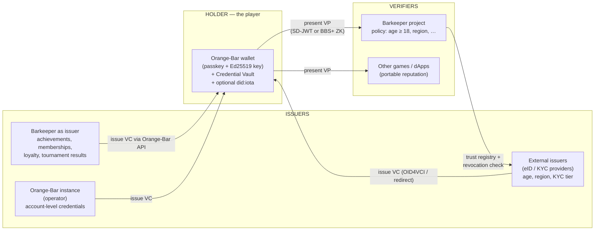
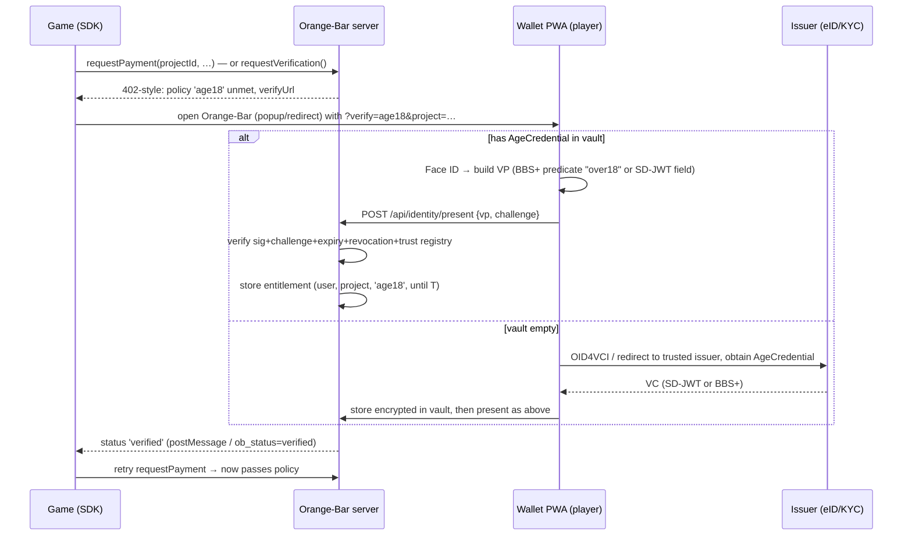

# Orange-Bar × IOTA Identity — Architecture

**Status: design document (nothing here is implemented yet).**
*Eine deutsche Zusammenfassung steht am Ende dieses Dokuments.*

This document describes how Orange-Bar can integrate the **IOTA Identity Framework**
(W3C Decentralized Identifiers + Verifiable Credentials on IOTA Rebased / MoveVM) to
add **verified-identity features** — age restrictions set by a Barkeeper, regional
gating, parental controls, portable cross-game reputation, and credential-gated
trading — while keeping the two things that define Orange-Bar: **passkey-only UX**
and **privacy for small in-game amounts**.

---

## 1. What IOTA Identity gives us (primer)

Facts below reflect the state of the framework at the time of writing; the Rebased
port is **alpha/beta** (v1.9.x-beta) and still moving.

| Building block | What it is | Why Orange-Bar cares |
|---|---|---|
| **DID (`did:iota`)** | A W3C Decentralized Identifier whose DID Document is stored in an **`Identity` shared Move object** on IOTA Rebased. | Every wallet (player), every Barkeeper project, and every issuer gets a stable, on-chain-anchored identity that anyone can resolve and verify. |
| **Multi-controller Identities** | An on-chain Identity can have **several controllers** with access control (independent or group/threshold control). | Custodial accounts: server + user both control. Self-custody: user only. Barkeeper projects: team-controlled. Parental control: guardian + child. |
| **Verifiable Credentials (VC)** | Signed claims from an *issuer* about a *holder* (e.g. "born 2003-04-01", "KYC tier 2", "beat final boss"). Stored **off-chain** by the holder; only anchors/status live on-chain. | The raw material for age checks, region checks, reputation, memberships. |
| **Verifiable Presentations (VP)** | The holder presents one or more VCs to a *verifier*, bound to a challenge (prevents replay). | The actual "prove it" step when a game asks for age ≥ 18. |
| **SD-JWT selective disclosure** | Issuer marks fields as individually disclosable; holder reveals only some fields. | Reveal `ageOver18: true` without revealing name or birthdate. |
| **BBS+ ZK selective disclosure (ZK-SD-VC / JPT)** | Zero-knowledge proofs over BBS+-signed credentials; the **holder decides ad hoc** what to disclose, presentations are **unlinkable** across verifiers. | The privacy-maximal path: prove a predicate without the issuer pre-planning it, and without letting two games correlate the same player. |
| **Revocation (RevocationBitmap2022 + BBS+ schemes)** | Issuer-side revocation embedded in the issuer's DID Document; checked at verification time. | Expired KYC, withdrawn parental consent, banned accounts. |
| **Domain Linkage Credentials** | Bidirectional proof that a DID and a web domain belong together (`/.well-known/did-configuration.json`). | "Verified Barkeeper" badges — anti-phishing for embedded wallets. |
| **WASM bindings (`@iota/identity-wasm`)** | The Rust library compiled for Node.js and browsers. | Server-side verification in Orange-Bar's Node backend **and** client-side proof generation in the PWA — fits our build-free stack. |

Two properties matter architecturally:

1. **Credentials live off-chain.** Only DID Documents (and revocation state) are
   on-chain. Personal data never touches the ledger — this is what makes age
   verification GDPR-sane.
2. **Writing DID Documents costs gas.** Creating/updating an `Identity` object is a
   Move transaction. Orange-Bar already has the answer: **the Barkeeper's gas
   station sponsors it**, exactly like it sponsors first transactions today.

---

## 2. Design goals

1. **Passkey UX stays untouched.** No new secrets for users. DID keys derive from
   what we already manage (custodial keys server-side, PRF-wrapped seed in
   self-custody). A player should get "✓ Age verified" with one Face ID prompt.
2. **Privacy by default, data minimization always.** Orange-Bar stores *proof
   results* ("over 18: yes, verified by issuer X, expires T"), never the underlying
   attributes (no birthdates, no names). BBS+ unlinkable presentations preferred
   where supported.
3. **The Barkeeper stays the admin of their own space.** Policies (age, region,
   KYC tier, membership) are **per project**, configured in the existing Barkeeper
   panel, enforced server-side, consumed through the existing SDK.
4. **Mobile-first.** Every new flow works in the popup **and** the redirect mode,
   because in-app browsers block popups. Verification results survive the redirect
   round-trip the same way payments do (`ob_status` / `checkReturn()`).
5. **Progressive decentralization.** Everything works day one with Orange-Bar as
   the verifier and a small trust registry; power users and self-custody wallets can
   hold their own on-chain DID and present credentials anywhere else too.
6. **Honest scope.** IOTA Identity on Rebased is alpha/beta. The design isolates it
   behind one server module + one client module so version churn doesn't ripple
   through the app.

---

## 3. Roles mapped onto Orange-Bar



- **Holder** = the player. The wallet keypair Orange-Bar already manages doubles as
  the DID/presentation key. The **Credential Vault** is new: encrypted storage for
  the player's VCs (same AES-256-GCM master-key model as wallet keys; in
  self-custody mode the vault is encrypted with the PRF-derived key, so the server
  cannot read credentials either).
- **Issuer** is pluggable. Realistically, day one: the **Barkeeper** (game
  achievements, memberships) and the **Orange-Bar operator** (account age, "human"
  attestation). Age/KYC credentials come from **external issuers** (eIDAS wallets,
  KYC providers) once available — the architecture treats them as just another
  trusted issuer in the registry.
- **Verifier** = the Barkeeper's project via Orange-Bar's **policy engine**, or any
  third party (credentials are standard W3C VCs, so they work outside Orange-Bar too).

---

## 4. New components

Everything below is additive; no existing module changes its contract.

```
server/
  identity/
    did.js            DID lifecycle: create/resolve/update Identity objects
                      (lazy, gas-sponsored), key material from existing wallet layer
    vault.js          Credential Vault: encrypted VC storage + metadata index
    issuer.js         Issuance: Barkeeper/operator-issued VCs (SD-JWT or BBS+),
                      revocation bitmap management
    verifier.js       Verification: VP checks (signature, challenge, expiry,
                      revocation, trust registry), returns normalized "claims"
    policy.js         Policy engine: evaluates project policies against
                      entitlements; race-safe like the gas-limit path
    registry.js       Trust registry: which issuer DIDs are accepted for which
                      credential type (instance-level defaults + per-project)
  routes/
    identity.js       /api/identity/* endpoints (below)
public/
  identity.js         Client: WASM loading (lazy!), VP building, consent UI glue
  vendor/identity-wasm/  @iota/identity-wasm browser build (self-hosted, no CDN)
```

### 4.1 Data model (SQLite migrations v7…)

```sql
-- One DID per user (lazy-created) and per project
CREATE TABLE dids (
  owner_kind   TEXT NOT NULL,            -- 'user' | 'project' | 'instance'
  owner_id     TEXT NOT NULL,
  did          TEXT NOT NULL UNIQUE,     -- did:iota:<network>:0x…
  object_id    TEXT,                     -- on-chain Identity object (NULL = off-chain did:key stage)
  network      TEXT NOT NULL,
  created_at   INTEGER NOT NULL,
  PRIMARY KEY (owner_kind, owner_id)
);

-- Credential Vault: the VC payload is encrypted (server master key, or PRF-wrapped
-- for self-custody users); metadata stays queryable
CREATE TABLE credentials (
  id           TEXT PRIMARY KEY,
  user_id      TEXT NOT NULL REFERENCES users(id) ON DELETE CASCADE,
  type         TEXT NOT NULL,            -- e.g. 'AgeCredential', 'AchievementCredential'
  issuer_did   TEXT NOT NULL,
  format       TEXT NOT NULL,            -- 'sd-jwt' | 'zk-bbs' | 'jwt'
  ciphertext   BLOB NOT NULL,            -- encrypted VC
  status_url   TEXT,                     -- revocation reference
  expires_at   INTEGER,
  created_at   INTEGER NOT NULL
);

-- Per-project verification policies, edited in the Barkeeper panel
CREATE TABLE project_policies (
  project_id   TEXT NOT NULL REFERENCES projects(id) ON DELETE CASCADE,
  policy_id    TEXT NOT NULL,
  policy       TEXT NOT NULL,            -- JSON, see §6
  enabled      INTEGER NOT NULL DEFAULT 1,
  PRIMARY KEY (project_id, policy_id)
);

-- Cached, privacy-minimal verification results ("entitlements")
CREATE TABLE entitlements (
  user_id      TEXT NOT NULL REFERENCES users(id) ON DELETE CASCADE,
  project_id   TEXT NOT NULL REFERENCES projects(id) ON DELETE CASCADE,
  policy_id    TEXT NOT NULL,
  result       TEXT NOT NULL,            -- 'granted'
  issuer_did   TEXT NOT NULL,            -- who vouched
  proof_hash   TEXT NOT NULL,            -- hash of the VP (audit, no PII)
  verified_at  INTEGER NOT NULL,
  expires_at   INTEGER NOT NULL,         -- min(credential expiry, policy maxAge)
  PRIMARY KEY (user_id, project_id, policy_id)
);

-- Trust registry
CREATE TABLE trusted_issuers (
  scope        TEXT NOT NULL,            -- 'instance' or a project_id
  credential_type TEXT NOT NULL,
  issuer_did   TEXT NOT NULL,
  note         TEXT,
  PRIMARY KEY (scope, credential_type, issuer_did)
);
```

**What is deliberately NOT stored:** birthdates, names, nationality, document
numbers, raw presentations. The `entitlements` row is the whole memory of an age
check: *granted / by whom / until when / hash for audit*.

### 4.2 Key management (the part that must not be wrong)

| Mode | Wallet key today | DID assertion key | Vault encryption |
|---|---|---|---|
| **Custodial** (default) | Ed25519 seed, AES-256-GCM under server master key | same key, or a derived subkey, managed by `did.js` | server master key |
| **Self-custody (PRF)** | seed PRF-wrapped per passkey, server has no copy | client-side signing via the existing `iota-sign.js` path; DID updates are built server-side, signed locally, submitted via `tx/submit` — **identical pattern to payments** | PRF-derived key (server stores only ciphertext) |

DIDs are **lazy**: an account starts DID-less. The first time a policy requires a
presentation (or the user opens the new *Identity* tab), Orange-Bar creates the DID —
**off-chain first** (`did:key`-style from the existing public key, zero gas), and
upgrades it to an on-chain `did:iota` Identity object only when something actually
needs on-chain anchoring (issuing to others, multi-controller, revocation hosting).
The upgrade transaction is **sponsored by the gas station** of the project that
triggered it, or by the instance operator — a player never needs gas to get verified.

---

## 5. Core flows

### 5.1 Age verification (the headline feature)

The Barkeeper toggles "Age restriction: 18+" in the panel. From then on:



Design decisions baked in:

- **Challenge-bound**: the VP signs a server nonce tied to the session and project,
  same one-time-challenge discipline as our WebAuthn tx-confirm flow. No replay.
- **Cached as entitlement**: the player proves age **once per project** (until the
  credential or policy TTL expires) — after that, purchases are exactly as fast as
  today. This is what makes it viable on mobile.
- **Graceful ladder of privacy**: BBS+ ZK predicate if the credential supports it →
  SD-JWT disclosure of a single `ageOver18` field → (only if a Barkeeper explicitly
  configures it and the issuer offers nothing better) plain VC. The server records
  the same minimal entitlement in all three cases.
- **Redirect parity**: in redirect mode the game returns with
  `?ob_verify=age18&ob_status=verified`, consumed by the existing `checkReturn()`
  pattern.

### 5.2 Barkeeper as issuer (achievements, membership, loyalty)

The Barkeeper panel gets an "Issue credentials" card. The project's DID (created
with the project, sponsored by its own station) signs VCs like:

```json
{
  "type": ["VerifiableCredential", "AchievementCredential"],
  "issuer": "did:iota:mainnet:0x…project…",
  "credentialSubject": {
    "id": "did:iota:mainnet:0x…player…",
    "achievement": "dragon-slayer",
    "season": 3
  },
  "credentialStatus": { "type": "RevocationBitmap2022", "...": "…" }
}
```

SDK call: `ob.issueCredential({ playerRef, type, claims })` (server-to-server with
the project secret — the same `obk_…` secret that already exists). The player sees
"🏆 New credential from *Mein Spiel*" and accepts it into the vault.

**Why this matters for tradability:** these credentials are the portable layer —
see §7.

### 5.3 Verified Barkeeper (anti-phishing)

A Barkeeper links their project DID to their domain via a **Domain Linkage
Credential** (`/.well-known/did-configuration.json` on their game's domain +
service entry in the DID Document). Orange-Bar verifies the linkage and shows a
**✓ verified badge with the domain name** in the payment sheet. Players learn to
trust the badge, not the memo text — this directly attacks the biggest real-world
risk of embedded wallets (a malicious page opening a look-alike payment).

### 5.4 Parental control (guardian model)

Multi-controller Identities make this clean:

- A child account's on-chain Identity has **two controllers**: child + guardian.
- The guardian issues (or approves) a `ParentalConsentCredential` with spending
  policy claims (`dailyLimitNanos`, `allowedProjects`, `tradeApproval: true`).
- Orange-Bar's policy engine enforces it exactly like a Barkeeper policy — and the
  guardian can **revoke** it (revocation bitmap), which kills the entitlement at
  the next check.
- Guardian approvals for over-limit purchases reuse the pay-request flow: the
  request parks as `pending-approval`, the guardian gets a push notification, and
  confirms with **their** passkey.

---

## 6. The Barkeeper policy model

Policies are JSON, stored per project, edited in the panel, evaluated by
`policy.js` **server-side before** any gated action (payment confirm, gas claim,
credential issuance, trade):

```json
{
  "policyId": "age18",
  "require": {
    "credentialType": "AgeCredential",
    "predicate": { "claim": "ageOver18", "equals": true },
    "issuers": ["did:iota:…eid-bridge…", "did:iota:…kyc-provider…"],
    "formats": ["zk-bbs", "sd-jwt"]
  },
  "entitlementTtl": 15552000,
  "appliesTo": ["payment", "gas", "trade"],
  "fallback": "block"
}
```

Other policies a Barkeeper can compose from the same primitives:

| Policy | `credentialType` / predicate | Typical use |
|---|---|---|
| `age18` / `age16` / `age7` | `ageOverN == true` | USK/PEGI-style content & purchase gates |
| `region` | `jurisdiction in [...]` | loot-box law compliance per country |
| `kycTier` | `tier >= 2` | higher trade limits only for verified users |
| `membership` | Barkeeper-issued `MemberCredential` | subscriber-only shops |
| `guardianConsent` | `ParentalConsentCredential` valid & unrevoked | minors' purchases |
| `human` | operator-issued `PersonhoodCredential` | bot-resistant drops/tournaments |

**Enforcement points** (all already exist, each gets one `policy.check()` call):
`tx/prepare` & `tx/confirm`, `claim-gas`, `pay/request` acceptance, and the new
trade endpoints. The check is a single indexed `entitlements` lookup — O(1),
no crypto on the hot path.

---

## 7. Tradability: what Identity unlocks

This is where Identity turns Orange-Bar from "a wallet games embed" into
"an economy layer games share".

### 7.1 Credential-gated P2P trading & marketplace

Today Orange-Bar can send NFTs to any address. With Identity, a **trade** becomes:
offer + counterparty policy check + atomic settlement.

- Listings can carry requirements: *"sellable only to `age18` holders"*,
  *"tournament finalists only"*, *"same-region only"* — enforced at settlement,
  not just in the UI.
- High-value trades escalate to `kycTier` policies; small trades stay frictionless.
  **The wallet stays casual for small amounts — friction scales with value.**
- Every settlement can emit a Barkeeper-signed `TradeReceiptCredential` to both
  parties: portable, disputable proof of the trade without a central database.

### 7.2 Portable reputation across games

Barkeeper-issued achievement/reputation VCs live in the player's vault and are
**presentable to any other project** (holder consent per presentation, BBS+ keeps
them unlinkable if desired):

- Game B grants a starter pack to holders of Game A's "Season 3 finisher" VC —
  a **cross-promotion primitive with no backend integration between the games**:
  the credential itself is the integration.
- Marketplace sellers present reputation ("50 disputes-free trades") to unlock
  better fees — reputation follows the *player*, not the platform.

### 7.3 Verified creators & provenance

- NFT mints by a project with a domain-linked DID show **verified provenance**
  ("minted by ✓ meingame.example") in every Orange-Bar wallet and in third-party
  tooling, because it's a standard Domain Linkage Credential, not an Orange-Bar
  convention.
- Royalty/edition claims ride in a `ProvenanceCredential` alongside the NFT —
  auditable off-chain, anchored to the on-chain object ID.

### 7.4 Compliance as a feature, not a wall

Age/region/KYC gating is what lets a Barkeeper sell **regulated content**
(gambling-adjacent mechanics, 18+ content, jurisdictions with loot-box rules) at
all. The architecture makes the compliant path also the *private* path: the
Barkeeper never learns a birthdate — only "policy met, attested by issuer X".
That's a sales argument to game studios, not just a legal checkbox.

---

## 8. SDK extensions (mobile & games)

```js
const ob = new OrangeBar('https://wallet.example', { projectId: 'proj_…' });

// 1) Standalone verification (menu screens, age gates before content)
const v = await ob.requestVerification({ policy: 'age18', mode: 'auto' });
// → { status: 'verified' | 'rejected' | 'unavailable', expiresAt }

// 2) Payments that carry requirements (single round-trip on the happy path;
//    the wallet interleaves verify+pay in ONE popup/redirect if needed)
await ob.requestPayment({ to, amountIota: '4.99', memo: '18+ DLC',
                          requires: ['age18'] });

// 3) Server-to-server issuance (project secret; never from the game client)
await fetch('https://wallet.example/api/projects/issue-credential', {
  headers: { Authorization: `Bearer ${OBK_SECRET}` },
  body: JSON.stringify({ playerRef, type: 'AchievementCredential', claims }) });

// 4) Reading a verification the player agreed to share with the game
const token = v.attestation; // short-lived JWT signed by the Orange-Bar instance
// game backend verifies with GET /.well-known/jwks.json — no IOTA stack needed
```

Mobile specifics:

- **Redirect-mode parity** for `requestVerification` (`ob_verify`/`ob_status`
  params, consumed by `checkReturn()`), because in-app browsers block popups.
- **Lazy WASM**: `@iota/identity-wasm` is ~large; it loads only when the Identity
  tab or a verification is opened, never on wallet start. Verification results are
  cached as entitlements so the WASM path is cold-path only.
- **Attestation JWTs for game backends**: games shouldn't need the IOTA stack to
  *consume* results. The instance signs a plain JWT ("player P satisfied policy
  age18 until T"); a game backend verifies it against the instance's JWKS like any
  OIDC token. Full VCs remain available for parties that want to verify end-to-end.
- **Deep links / app switches** to external issuer wallets (eID apps) use the same
  return-URL discipline (http/https allowlist) as the payment redirect flow.

---

## 9. Security & privacy analysis (delta)

| Threat | Mitigation |
|---|---|
| Replayed presentations | Server-issued one-time challenge per VP, TTL'd, single-use (same table/discipline as WebAuthn challenges). |
| Fake issuers | Trust registry: only allowlisted issuer DIDs per credential type count; per-project override narrows, never widens, the instance list. |
| Revoked credentials honored | Revocation checked at presentation time; entitlement TTL ≤ credential validity; periodic re-check job for long-lived entitlements (reuses the balance-watcher scheduling pattern). |
| Cross-game tracking of players | BBS+ unlinkable presentations preferred; entitlements are scoped per project; DIDs are not exposed to games (games see opaque `playerRef` + attestation JWTs). |
| PII on server | None by design: vault ciphertext (server-unreadable in self-custody mode), boolean entitlements, proof hashes. GDPR erasure = delete vault + entitlements rows; nothing on-chain contains personal data. |
| Malicious embedding page | Domain Linkage → verified-badge UX; policies and secrets are enforced server-side; origin allowlists already gate pay/gas and extend to verify. |
| Gas-drain via DID creation | DID upgrades are gas-sponsored **through the existing per-user, race-safe limit machinery** of the station — same reservation pattern, same audit log. |
| Framework immaturity (alpha) | All Identity code isolated in `server/identity/` + `public/identity.js`; formats pinned; contract tests against `@iota/identity-wasm` mirror the SDK-parity approach used for `iota-sign.js`. |

---

## 10. Rollout plan

| Phase | Scope | Depends on |
|---|---|---|
| **1 — Foundations** | `identity/` module, migrations v7, lazy `did:key`-stage DIDs, Credential Vault, trust registry, Identity tab (list/accept/delete credentials) | nothing external |
| **2 — Verify & gate** | Policy engine + entitlements, Barkeeper policy UI (age/region/membership toggles), `requestVerification` SDK + redirect parity, attestation JWTs | Phase 1 |
| **3 — Issue & badge** | Project DIDs on-chain (station-sponsored), Barkeeper issuance API + revocation bitmap, Domain Linkage "verified Barkeeper" badge | Phase 1; Rebased Identity beta |
| **4 — Trade & guard** | Credential-gated trading/marketplace endpoints, trade receipts, parental-control guardian flow (multi-controller) | Phases 2+3; multi-controller GA |
| **5 — ZK-max** | BBS+ ZK predicates end-to-end, unlinkable presentations by default, external eID/KYC issuer integrations (OID4VCI) | issuer ecosystem availability |

Honest risks: the Rebased port of IOTA Identity is **alpha/beta** (breaking changes
likely); external age/KYC issuers for consumers are still scarce (eIDAS 2.0 wallets
will change that); BBS+ predicate proofs and multi-controller features must be
validated against the then-current release before Phase 4/5 commitments. Phases 1–2
carry no such dependency and deliver the Barkeeper age gate with SD-JWT already.

---

## Zusammenfassung (Deutsch)

Das **IOTA Identity Framework** (W3C DIDs + Verifiable Credentials auf IOTA
Rebased/MoveVM) erweitert Orange-Bar um eine Identitätsschicht, ohne die
Passkey-UX anzutasten:

- **Altersbeschränkung durch den Barkeeper:** Der Barkeeper schaltet pro Projekt
  eine Policy (z. B. „18+") frei. Der Spieler weist sein Alter **einmal** mit
  einem Nachweis eines vertrauenswürdigen Ausstellers nach — dank **SD-JWT** bzw.
  **BBS+-Zero-Knowledge** nur als „über 18: ja", **ohne Geburtsdatum oder Namen
  preiszugeben**. Orange-Bar speichert nur das Ergebnis („Entitlement" mit
  Ablaufdatum), danach sind Käufe so schnell wie heute. Gleiches Prinzip für
  Region, KYC-Stufe, Mitgliedschaft, **Kindersicherung** (Eltern als
  Mit-Controller der On-Chain-Identität, mit widerrufbarer Einwilligung).
- **Handelbarkeit:** Credential-beschränkter P2P-Handel und Marktplatz (Alters-/
  Regions-Gates bei der Abwicklung, KYC nur für hohe Beträge), **portable
  Reputation und Achievements über Spiele hinweg** (Cross-Promotion ohne
  Backend-Integration), **verifizierte Barkeeper** per Domain-Linkage-Badge
  (Anti-Phishing) und Provenienz-Nachweise für NFTs.
- **Mobil & Games:** Alles funktioniert im Popup **und** im Redirect-Modus; Spiele
  konsumieren Ergebnisse als einfache signierte JWTs (kein IOTA-Stack nötig);
  das WASM-Modul lädt nur bei Bedarf. DID-Erstellung wird — wie heute das Startgas —
  **von der Gas Station des Barkeepers gesponsert**.
- **Ehrliche Einschränkung:** IOTA Identity auf Rebased ist Alpha/Beta, und
  Alters-Aussteller für Endkunden (eIDAS-Wallets, KYC-Anbieter) sind noch im
  Aufbau. Phasen 1–2 (Vault, Policy-Engine, Alters-Gate per SD-JWT) sind davon
  unabhängig umsetzbar; ZK-Maximalausbau folgt mit dem Ökosystem.

---

## Sources

- [IOTA Identity repository (MoveVM implementation)](https://github.com/iotaledger/identity)
- [IOTA Identity releases (v1.9.x-beta for Rebased)](https://github.com/iotaledger/identity/releases)
- [IOTA Identity Alpha Release for Rebased (blog)](https://blog.iota.org/iota-identity-alpha-release/)
- [On-chain Identity objects (docs)](https://docs.iota.org/developer/iota-identity/explanations/about-identity-objects)
- [IOTA DID Method Specification v2.0](https://docs.iota.org/developer/iota-identity/references/iota-did-method-spec)
- [Verifiable Credentials (docs)](https://docs.iota.org/iota-identity/explanations/verifiable-credentials)
- [Selective Disclosure SD-JWT (docs)](https://docs.iota.org/developer/iota-identity/how-tos/verifiable-credentials/selective-disclosure)
- [Zero-Knowledge Selective Disclosure ZK-SD-VCs (docs)](https://docs.iota.org/developer/iota-identity/how-tos/verifiable-credentials/zero-knowledge-selective-disclosure)
- [IOTA Identity integrates Zero-Knowledge credentials (blog)](https://blog.iota.org/iota-identity-zero-knowledge/)
- [IOTA Identity product page](https://www.iota.org/products/identity)
